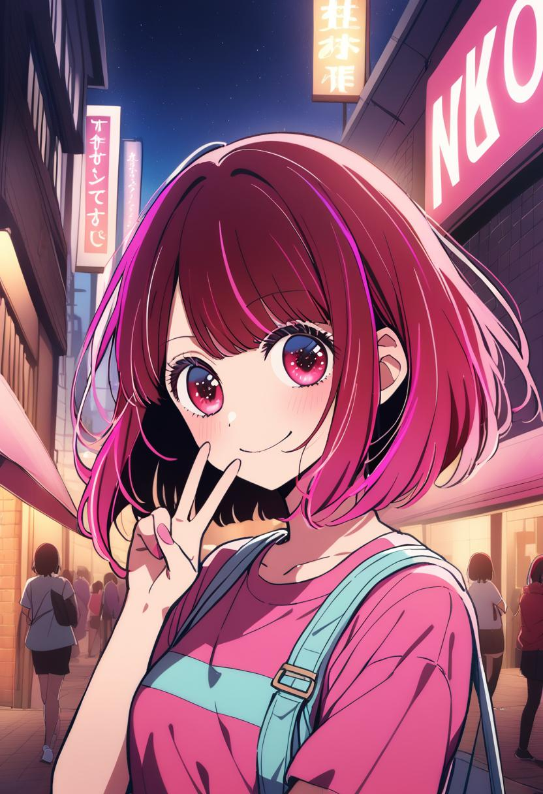
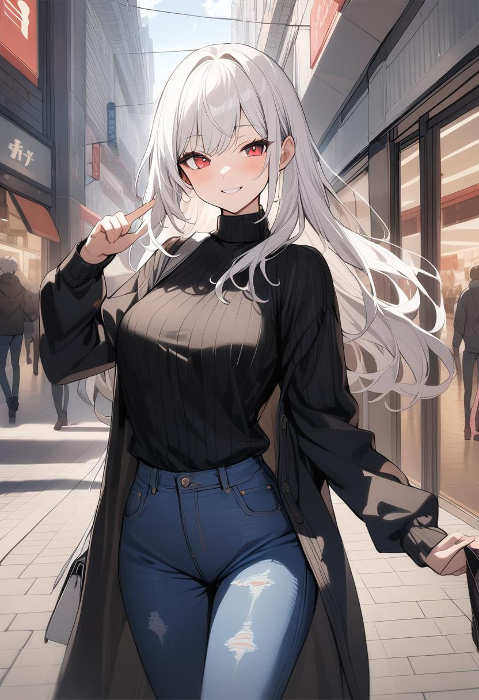

# animagine
animation image generation repository for personal usage, based on animagine-xl-3.0

## prerequisite

you can choose to clone the repository under specific folder or download the model automatically using huggingface.

### CHOICE ONE: clone animagine-xl-3.0 from huggingface

make sure download git-lfs before clone the repository

#### 1. download git-lfs with sudo permit

Debian / Ubuntu
```
curl -s https://packagecloud.io/install/repositories/github/git-lfs/script.deb.sh | sudo bash
sudo apt-get install git-lfs
```
MacOS (Using Homebrew)
```
brew update
brew install git-lfs
```
apt-get
```
sudo apt-get install git-lfs
git-lfs install
```

#### download git-lfs without sudo permit

```
wget https://github.com/git-lfs/git-lfs/releases/download/v3.2.0/git-lfs-linux-amd64-v3.2.0.tar.gz

tar -xzf git-lfs-linux-amd64-v3.2.0.tar.gz

# change the directory below to local git-lfs-3.2.0 so that git-lfs can be used under other directory

PATH=$PATH:~/code/support/git-lfs-3.2.0

git-lfs install

git-lfs version
```

### 2. download the model from hugging face

[website](https://huggingface.co/Linaqruf/animagine-xl-3.0)

```
git clone https://huggingface.co/Linaqruf/animagine-xl-3.0
```

The whole repository is about 26 GB, make sure have enough space.

***After download, make sure to change the model dircetory in [generate.py](generate.py) to local folder. Other wise it will automatically download the model again.***

### CHOICE TWO: download model from huggingface automatically

It will automatically download the model at the first time you run the [generate.py](generate.py) file, it will save the model under the default directory. Create a soft link to download the model under other directory instead of the deafult one can make it easier to manage them.

#### (OPTIONAL) create soft link for huggingface download directory


The deafault directory to save model is:
- `~/.cache/huggingface/hub` for mac and linux
- `C:\Users\username\.cache\huggingface\hub` for Windows

```
ln -s PATH_TO_OTHER_DIRECTORY PATH_TO_DEAFAULT_DIRECTORY
```

### set up python environment

#### (optional)create a new environment with conda and activate it

```
conda create -n python310 python=3.10

conda activate python310
```

#### download required libraries

can be found in README.md file in the animagine-xl-3.0 repository

```
pip install diffusers --upgrade
pip install transformers accelerate safetensors
```

## Generate Image!

Make sure the required libraries are installed, open [generate.py](generate.py)

You can modify the main fuction if you want to choose the way to store images.

Deafult output path is create an output folder in this directory and create a new folder with the prompt content and current time.

#### 1.Try the code with single attempt:

```
python generate.py -s
```



#### 2. Try the code with multiple attempt:

```
python generate.py -m
```

#### 3. Try the code with specific output folder:

```
python generate.py -s -o PATH_TO_FOLDER
```

#### 4. Try the code with specific prompt:

```
python generate.py -s -p "1girl, young girl, smile, upper body, blond hair, blue eyes, one-piece dress, looking at viewer, mountain, flower, masterpiece, detailed"
```


#### 5. Try the code with specific negative prompt:(NOT RECOMMEND)

```
python generate.py -s -n "NEGATIVE PROMPT"
```

***CAUTION***

- You can only choose single OR multiple prompt, if all set to True, it will gernerate single.
- output, prompt and negative prompt can be use together to gerneate specific output
- DO NOT RECOMMEND specific hand position or body position unless you clam it clearly enough, otherwise the output would be very weird
- Recommend to run the code with GPU. (7s per picture with V-100 GPU)

### other example

provided 3 prompt in [prompt.txt](prompt.txt)

prompt2:


prompt3:

